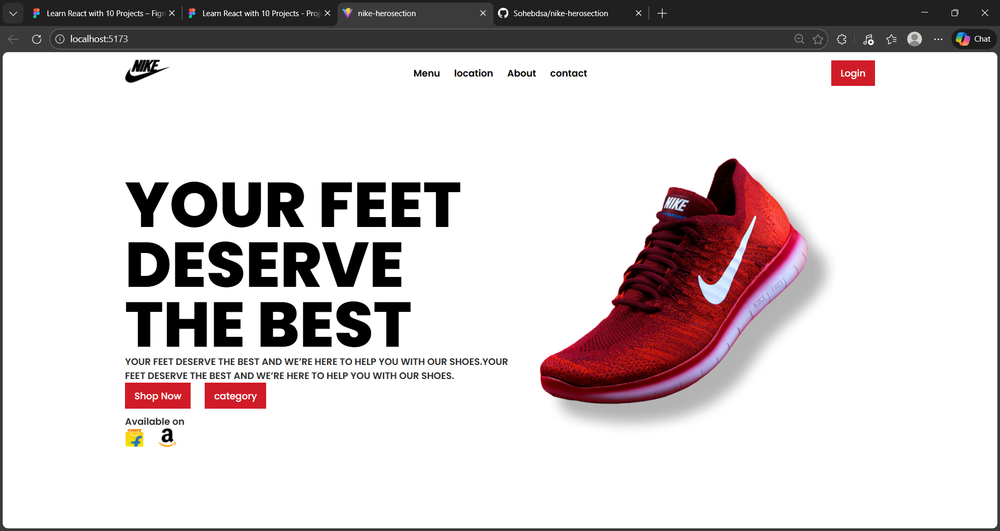

# Nike HeroSection Website

A simple and modern **Nike brand landing page** built with React and Vite.  
This project showcases a responsive hero section with brand logos, product images, and clean UI styling.

---
## 📸 Preview


## 🚀 Features
- Responsive hero section layout  
- Nike shoe product showcase  
- Brand logos (Amazon, Flipkart, Nike)  
- Modern CSS styling  
- Built with React + Vite for fast development  

---

## 🛠 Tech Stack
- **React** – Frontend framework  
- **Vite** – Bundler & dev server  
- **CSS** – Custom styling  
- **JavaScript (ES6+)**

## 📂 Project Structure

```text
nike-herosection/
├── public/
│   └── img/ (brand logos & product images)
├── src/
│   ├── components/
│   │   ├── Header.jsx
│   │   ├── HeroSection.jsx
│   │   ├── header.css
│   │   └── hero.css
│   ├── App.jsx
│   ├── App.css
│   ├── index.css
│   └── main.jsx
├── index.html
├── package.json
└── vite.config.js
```
